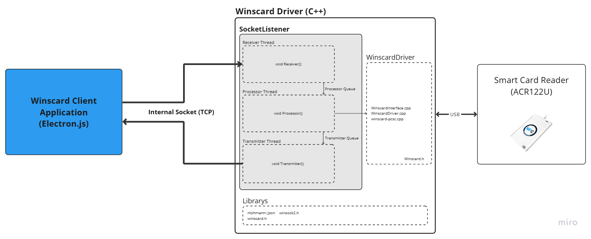

# ScardDriver

## 개요
이 프로젝트는 TCP/IP Socket 인터페이스로 동작하는 Windows 스마트카드 판독기 Driver입니다.

이 Application은 Scard-electron-react-app 프로젝트의 하위 프로세스로 동작하며, TCP Socket을 통해 데이터를 주고 받습니다.

Client Program에 대한 자세한 내용은 다음 Repository를 참고하시기 바랍니다.   
[Scard-electron-react-app](https://github.com/kg3546549/Scard-electron-react-app)


## Block Diagram


## 상세 내용

### Work-Flow
1. 프로그램 실행 시 Socket을 생성하여 Client의 연결 요청을 대기(Listening).
1. Client가 접속에 성공하면 Receiver, Processor, Tramsmitter thread를 실행.
1. 각 Thread 끼리는 공용 Queue로 데이터를 전달.
1. Socket 연결이 종료되면 Receiver, Processor, Transmitter Thread를 종료하고, Client의 연결을 대기.

### Receiver : 요청 메세지 수신 및 Parsing
Receiver에서는 socket으로 들어오는 JSON 데이터를 수신하여 올바른 Protocol인지 확인 후 인스턴스화 하여 Processor에게 전달.

### Processor : 스마트카드 판독기를 Control
`ProcessWinscard() - WinscardDriver`를 이용하여 스마트카드 판독기를 조작.

자세한 스마트카드 판독기 조작에 관한 내용은 하기 [Application Protocols](#application-protocols) 항목을 참고.

스마트카드 판독기에서 받은 응답을 Transmitter에 전달

### Transmitter : 결과 데이터 Pasing 및 응답 메세지 송신
Processor Thread에서 전달받은 결과 데이터를 JSON으로 변환 및 Socket Client에게 전송.

### Thread 간 통신
위에서 설명한 세 Thread는 모두 SocketListener Class의 메소드로 선언되어있음.

Socket Connect되면 세 Thread가 Class 인스턴스의 메소드로 실행됨.

``` C++
std::thread recvTask( &SocketListener::Receiver, this);
std::thread procTask(&SocketListener::Processor, this);
std::thread transmitTask(&SocketListener::Transmitter, this);
```
해당 클래스의 Private Property로 `processQueue`, `transmitQueue`가 존재.

현재 Thread 에서 다음 Thread로 요청을 전달하기 위해, queue를 통해 데이터를 Push.
Mutex를 사용하여 Thread 간의 동시 접근 시에 Critical Section 발생을 방지함.


## Protocol Structure

> **Message Type** : JSON

| 필드 이름 | 타입  | 설명 |
|-----------|------|------|
| Command | uint8 | 명령 코드 |
| Sender | number | 전송자 |
| msgCnt | number | 전송할  |
| uuid | string | 전송할 데이터 |
| result | number | 결과 |
| dataLength | number | 데이터 길이 |
| data | string array | 요청/응답 데이터 |

#### Request Example
``` JSON
{
  "cmd": 101, //Establish Context
  "sender": 0, //Request(Client)
  "msgCnt": 1, //Not Use
  "uuid" : "550e8400-e29b-41d4-a716-446655440000",
  "result": 0, //Success
  "dataLength": 1,
  "data": ["FFFFFFFFFFFF"]
}
```

## Protocol List
- [Cmd_Err : 0](#cmd_err--0)
- [Cmd_Socket_Execute : 10](#cmd_socket_execute--10)
- [Cmd_Socket_Connect : 11](#cmd_socket_connect--11)
- [Cmd_Socket_Disconnect : 12](#cmd_socket_disconnect--12)
- [Cmd_SCard_Establish_Context : 101](#cmd_scard_establish_context--101)
- [Cmd_Scard_Release_Context:1001](#cmd_scard_release_context1001)
- [Cmd_SCard_Reader_List : 102](#cmd_scard_reader_list--102)
- [Cmd_SCard_Connect_Card : 103](#cmd_scard_connect_card--103)
- [Cmd_SCard_Disconnect_Card : 104](#cmd_scard_disconnect_card--104)
- [Cmd_SCard_Transmit : 105](#cmd_scard_transmit--105)
- [Cmd_SCard_GetATR : 106](#cmd_scard_getatr--106)

- [Cmd_MI_Get_UID : 201](#cmd_mi_get_uid--201)
- [Cmd_MI_Load_Key : 202](#cmd_mi_load_key--202)
- [Cmd_MI_Authentication : 203](#cmd_mi_authentication--203)
- [Cmd_MI_Read_Block : 204](#cmd_mi_read_block--204)
- [Cmd_MI_Write_Block : 205](#cmd_mi_write_block--205)
- [Cmd_MI_Decrement : 206](#cmd_mi_decrement--206)
- [Cmd_MI_Increment : 207](#cmd_mi_increment--207)
- [Cmd_MI_Restore : 208](#cmd_mi_restore--208)
- [Cmd_MI_HALT : 209](#cmd_mi_halt--209)

Socket Commands
---
### Cmd_Err : 0
### Cmd_Socket_Execute : 10

### Cmd_Socket_Connect : 11
### Cmd_Socket_Disconnect : 12

 Winscard.h Commands
---
### Cmd_SCard_Establish_Context : 101
SCard Context (`hContext`)를 생성 및 초기화

### Cmd_Scard_Release_Context:1001
SCard Context (`hContext`)를 해제

### Cmd_SCard_Reader_List : 102
현재 PC에 연결되어있는 Reader List를 요청

### Cmd_SCard_Connect_Card : 103
Card에 연결하여 `hCard`를 생성

### Cmd_SCard_Disconnect_Card : 104
Card와 연결을 해제

### Cmd_SCard_Transmit : 105
Card에게 APDU를 전송

### Cmd_SCard_GetATR:106
Card의 ATR을 요청

ISO14443 Mifare Commands
---
### 

### Cmd_MI_Get_UID : 201
> This command returns the serial number or ATS of the connected PICC.

이 명령어는 연결된 PICC(카드)의 카드 시리얼 넘버(CSN) 혹은 ATS를 리턴합니다.

#### Request Data Field : None
| Index | Description |
|:--:|-|
| - | - |

#### Request Example
``` JSON
{
  "cmd": 201,
  "sender": 0, //Request or Response
  "msgCnt": 1, //Not Use
  "uuid" : "xxxxxxxx-xxxx-xxxx-xxxx-xxxxxxxxxxxx",
  "result": 99, //Fail
  "dataLength": 0,
  "data": []
}
```

#### Response Example
``` JSON
{
  "cmd": 201,
  "sender": 1, //Request or Response
  "msgCnt": 1, //Not Use
  "uuid" : "xxxxxxxx-xxxx-xxxx-xxxx-xxxxxxxxxxxx",
  "result": 00, //Fail
  "dataLength": 1,
  "data": ["0123ABCD"] //UID(CSN)
}
```

#### Raw Command
```C
unsigned char apduCommand[] = { 0xFF, 0xCA, 0x00, 0x00, 0x00 };
```

### Cmd_MI_Load_Key : 202
> This command loads the authentication keys into the reader. The authentication keys are used to authenticate the particular sector of the MIFARE Classic 1K/4K memory card. Volatile authentication key location is provided.

이 명령어는 인증 키를 리더에 Load합니다.  
인증 키는 각 Mifare Classic 1K/4K 메모리 섹터의 키를 인증하는 데에 사용됩니다.  
휘발성 인증 키 위치가 존재합니다.

#### Request Data Field
| Index | Description |
|:--:|-|
| 0 | Key ( 6Byte ) |

#### Request Example
``` JSON
{
  "cmd": 202,
  "sender": 0, //Request or Response
  "msgCnt": 1, //Not Use
  "uuid" : "xxxxxxxx-xxxx-xxxx-xxxx-xxxxxxxxxxxx",
  "result": 99, //Fail
  "dataLength": 1,
  "data": ["FFFFFFFFFFFF"] //Sector Num, Key Type
}
```

#### Response Example (!!! Need Check !!!)
``` JSON
{
  "cmd": 202,
  "sender": 1, //Request or Response
  "msgCnt": 1, //Not Use
  "uuid" : "xxxxxxxx-xxxx-xxxx-xxxx-xxxxxxxxxxxx",
  "result": 00, //Success
  "dataLength": 1,
  "data": ["FFFFFFFFFFFF"] //Sector Num, Key Type
}
```

#### Raw Command
``` C
unsigned char loadAuthenticationKeysCmd[] = { 0xff,0x82, 0x00,keyNum,0x06,0xff,0xff,0xff,0xff,0xff,0xff };
```

### Cmd_MI_Authentication : 203
> This command uses the keys stored in the reader to do authentication with the MIFARE 1K/4K card (PICC). Two types of authentication keys are used: TYPE_A and TYPE_B.

이 명령어는 리더에 저장되어있는 인증 키를 사용하여 MIFARE 1K/4K 카드의 인증을 시도합니다.  
Type A와 Type B 총 두가지 유형의 키가 사용됩니다.

#### Data Field
| Index | Description |
|:--:|-|
| 0 | Sector Number |
| 1 | Key Type(A or B) |

#### Request Example
``` JSON
{
  "cmd": 203,
  "sender": 0, //Request or Response
  "msgCnt": 1, //Not Use
  "uuid" : "xxxxxxxx-xxxx-xxxx-xxxx-xxxxxxxxxxxx",
  "result": 99, //Fail
  "dataLength": 2,
  "data": ["0", "A"] //Sector Num, Key Type
}
```

#### Response Example
``` JSON
{
  "cmd": 203,
  "sender": 1, //Request or Response
  "msgCnt": 1, //Not Use
  "uuid" : "xxxxxxxx-xxxx-xxxx-xxxx-xxxxxxxxxxxx",
  "result": 99, //Fail
  "dataLength": 2,
  "data": ["0", "A"] //Sector Num, Key Type
}
```

### Cmd_MI_Read_Block : 204
> This command retrieves the data blocks from the PICC. The data block/trailer block must be authenticated first.

이 명령어는 PICC(카드)로부터 데이터 블록을 가져옵니다(Read).  
가져오려는 데이터 블록 또는 트레일러 블록은 인증되어있어야 합니다.

#### Data Field
| Index | Description |
|:--:|-|
| 0 | Sector Number |
| 1 | Key Type(A or B) |

#### Request Example
``` JSON
{
  "cmd": 204,
  "sender": 0, //Request or Response
  "msgCnt": 1, //Not Use
  "uuid" : "xxxxxxxx-xxxx-xxxx-xxxx-xxxxxxxxxxxx",
  "result": 99, //Fail
  "dataLength": 1,
  "data": ["0"] //Block Num
}
```

#### Response Example
``` JSON
{
  "cmd": 204,
  "sender": 1, //Request or Response
  "msgCnt": 1, //Not Use
  "uuid" : "xxxxxxxx-xxxx-xxxx-xxxx-xxxxxxxxxxxx",
  "result": 00, //Fail
  "dataLength": 2,
  "data": ["0", "00000000000000000000000000000000"] //Block Num, Read Data
}
```

#### Raw Command
``` C
unsigned char readBinaryBlocks[] = { 0xff, 0xb0, 0x00, blkNum, 0x10 };
```

### Cmd_MI_Write_Block : 205


### Cmd_MI_Decrement : 206


### Cmd_MI_Increment : 207


### Cmd_MI_Restore : 208


### Cmd_MI_HALT : 209

